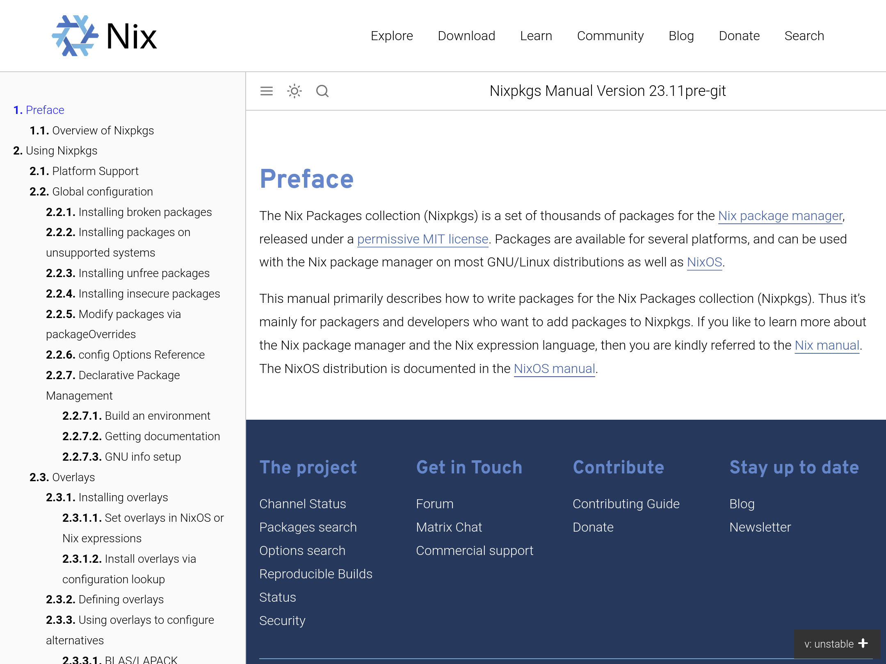
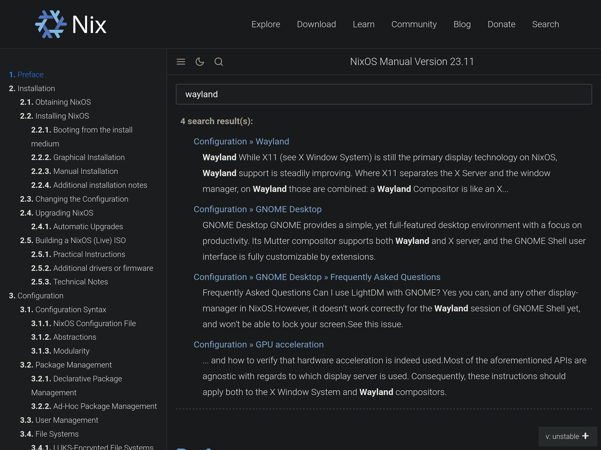

# Nix Manual Enhancements

This is a userscript that introduces some user experience enhancements to the Nixpkgs and the NixOS manuals.

| Nixpkgs, light                                   | NixOS, dark, search                                       |
| ------------------------------------------------ | --------------------------------------------------------- |
|  |  |

## Features

- Manual split into separate pages for each section
- Navigation through a collapsible sidebar
- Full-text search using [Orama](https://github.com/oramasearch/orama)
- Dark mode toggle using [Dark Reader](https://github.com/darkreader/darkreader)

## Installation

1. Install a userscript management browser extension (tested with [Tampermonkey](https://www.tampermonkey.net/)).
2. Open the [nix-manual-enhancements.user.js](https://github.com/Tomaszal/nix-manual-enhancements/releases/latest/download/nix-manual-enhancements.user.js) file in the [latest release](https://github.com/Tomaszal/nix-manual-enhancements/releases/latest).
3. The userscript manager should appear, where you simply need to click "Install".
4. **IMPORTANT (Firefox only)**: enable `layout.css.has-selector.enabled` flag in [`about:config`](about:config).
5. Done! Enjoy the manual enhancements.

## Background

Nixpkgs and NixOS offer very extensive manuals which contain a great amount of knowledge about the software. Unfortunately, those manuals have a lackluster user experience, simply presenting everything as one large, difficult to browse document. While there have been many failed and ongoing attempts to address this issue, there is still no official solution. So, as a temporary fix, I created this userscript, which is a "band-aid" solution that should be good enough until the official documentation is converted into a better format. Once that is done, this userscript will be archived and deprecated.

Historical resources relevant to this issue:

- [Discourse - Better navigation of nixos.org manuals](https://discourse.nixos.org/t/better-navigation-of-nixos-org-manuals/2085)
- [Discourse - Documentation improvements](https://discourse.nixos.org/t/documentation-improvements/3111)
- [Discourse - Documentation format](https://discourse.nixos.org/t/documentation-format/4650)
- [Discourse - Discourse - Documentation presentation (navigation)](https://discourse.nixos.org/t/documentation-presentation-navigation/6401)
- [Discourse - RFC 0072 FCP, Switch to CommonMark for documentation](https://discourse.nixos.org/t/rfc-0072-fcp-switch-to-commonmark-for-documentation/9560)
- [Discourse - Any consensus on documentation generation tool for nixpkgs manual?](https://discourse.nixos.org/t/any-consensus-on-documentation-generation-tool-for-nixpkgs-manual/15550)
- [Discourse - Dark mode on builtin nix docs](https://discourse.nixos.org/t/dark-mode-on-builtin-nix-docs/20193)
- [PR - [RFC 0064] New Documentation Format for nixpkgs and NixOS](https://github.com/NixOS/rfcs/pull/64)
- [PR - [RFC 0072] Switch to CommonMark for documentation](https://github.com/NixOS/rfcs/pull/72)
- [PR - nixpkgs manual in CommonMark using sphinx+myst and jupyter-book](https://github.com/NixOS/nixpkgs/pull/105036)
- [PR - Vacation PR: multi-paged, styled, searchable docs with wrapper tooling and epubs for NixOS and Nixpkgs](https://github.com/NixOS/nixpkgs/pull/68020)

Current resources to track regarding the current plan to resolve the issue:

- [Project - Conversion to CommonMark Docs](https://github.com/NixOS/nixpkgs/projects/37)
- [PR - doc: add nixpkgs manual split into multiple pages](https://github.com/NixOS/nixpkgs/pull/108063)
- [PR - nixos-manual with mmdoc](https://github.com/NixOS/nixpkgs/pull/254434)
